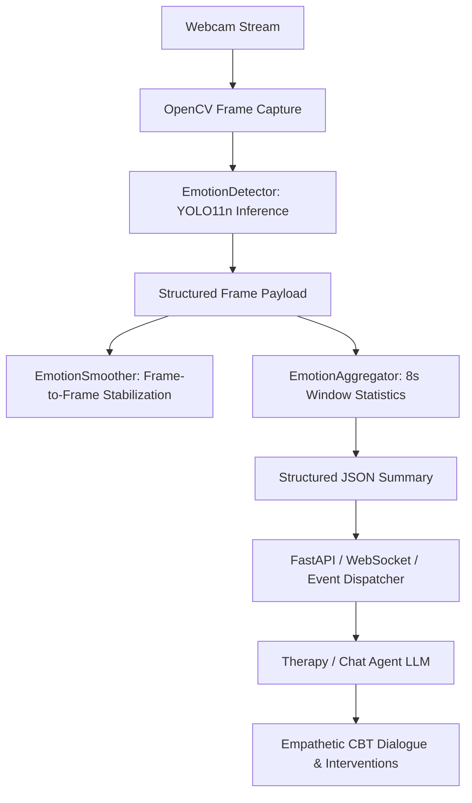

# Real-Time Facial Emotion Detection Service (FastAPI + YOLO11n)

A production-grade, standalone computer vision REST service and webcam monitoring system that performs real-time facial expression and emotion detection using a custom-trained **YOLO11n** model accelerated with **NVIDIA CUDA (RTX 3050)** and **FastAPI**.

---

## 1. Overview & Purpose

This service captures webcam video, detects human faces, and classifies facial emotions across **9 distinct emotion classes** in real-time. It continuously aggregates detections into **8-second statistical summaries** and exposes everything via a non-blocking **FastAPI REST API** for downstream consumption by web backends or therapy agents.

Key architectural features:
- **FastAPI REST API Layer**: Clean, asynchronous API routers for health checks, model metadata, session management, real-time observation streaming, and historical summary querying.
- **Non-Blocking Background Workers**: Dedicated worker threads handle physical OpenCV camera capture and YOLO inference asynchronously without blocking API request threads.
- **Camera Ownership Enforcement**: Strict single-session hardware locking (returns HTTP 409 Conflict if multiple sessions attempt to open the webcam simultaneously).
- **8-Second Continuous Emotion Aggregation**: Computes confidence-weighted distributions, observed expression trends, and duration persistence.
- **Hardware Acceleration**: Automatic GPU detection utilizing PyTorch with CUDA 12.8 on the NVIDIA GeForce RTX 3050 Laptop GPU.

---

## 2. Project Structure

```text
ImageEmotionDetection/
│
├── app/                          # FastAPI REST Application Package
│   ├── __init__.py
│   ├── main.py                   # FastAPI app factory, CORS, and lifecycle
│   ├── config.py                 # Pydantic settings, model paths, class mappings
│   │
│   ├── api/                      # API Endpoints
│   │   ├── system.py             # Root (/), /health, /status
│   │   ├── model.py              # /model/info, /model/classes
│   │   ├── sessions.py           # Session lifecycle & /current observation
│   │   ├── summaries.py          # /sessions/{id}/latest, /summary, /summaries
│   │   └── config.py             # GET/PUT /config runtime hyperparameters
│   │
│   ├── services/                 # Business & Perception Layer
│   │   ├── emotion_detector.py   # YOLO11n inference engine & model warmup
│   │   ├── emotion_aggregator.py # 8-second confidence-weighted summary engine
│   │   ├── session_manager.py    # In-memory session manager
│   │   └── webcam_service.py     # Background worker & hardware camera lock
│   │
│   ├── schemas/                  # Pydantic Schemas
│   │   ├── common.py             # Root, health, status schemas
│   │   ├── model.py              # Model info and classes schemas
│   │   ├── session.py            # Session control & details schemas
│   │   ├── emotion.py            # Observation & summary schemas
│   │   └── configuration.py      # Runtime configuration schemas
│   │
│   └── utils/
│       └── logging.py            # Structured logging setup
│
├── src/                          # Standalone OpenCV GUI Application
│   ├── webcam_emotion.py         # Standalone desktop webcam window with HUD
│   ├── emotion_detector.py       # Core detector
│   ├── emotion_aggregator.py     # Core aggregator
│   ├── emotion_smoother.py       # Rolling-window smoother
│   └── config.py                 # Standalone config
│
├── tests/
│   └── test_api_suite.py         # End-to-end REST API automated test suite
│
├── runs/                         # Model weights and training checkpoints
│   └── detect/emotion_training/facial_expression_yolo/weights/best.pt
│
├── requirements.txt              # Production dependencies
└── README.md                     # Documentation & setup guide
```

---

## 3. How to Run the Services

### Activate Virtual Environment:
```powershell
cd C:\Users\asus\Desktop\Projects\Capstone\ImageEmotionDetection
.\venv311\Scripts\Activate.ps1
```

### Option A: Start FastAPI REST Service (Production API):
```powershell
python -m uvicorn app.main:app --host 0.0.0.0 --port 8000
```
- **API Base URL**: `http://localhost:8000`
- **Interactive Swagger Docs**: `http://localhost:8000/docs`
- **ReDoc Documentation**: `http://localhost:8000/redoc`

### Option B: Run Standalone OpenCV Webcam GUI Window:
```powershell
python -m src.webcam_emotion
```


### Keyboard Controls:
- **`Q`** or **`ESC`**: Exit the application cleanly.
- **Window Close (`X`)**: Exits and automatically releases webcam and OpenCV resources.

---

## 6. How the YOLO11n Model Works

- **Architecture**: Ultralytics YOLO11 Nano (`YOLO11n`) — an anchor-free single-stage object detector optimized for ultra-low latency inference and high edge efficiency.
- **Dataset**: Trained on the Kaggle `8-facial-expressions-for-yolo` dataset with 9 distinct facial expression classes.
- **Performance**:
  - Image size: $640 \times 640$
  - Validation mAP50: **0.861**
  - Validation mAP50-95: **0.676**
- **Inference Lifecycle**:
  1. Input frame (OpenCV BGR numpy array) is passed to `EmotionDetector.detect()`.
  2. The detector runs `model.predict(..., device='0', verbose=False)` once per frame without saving images to disk.
  3. Bounding boxes (`xyxy`), confidence scores, and class labels are extracted and sorted by confidence descending.

---

## 7. Emotion Classes Reference

The model recognizes **9 emotion classes**:

| Class ID | Label | Description / Visual Indicators |
| :--- | :--- | :--- |
| **0** | `angry` | Lowered brows, tightened eyelids, pressed lips. |
| **1** | `contempt` | One-sided lip corner raised, asymmetrical smirk. |
| **2** | `disgust` | Wrinkled nose, raised upper lip. |
| **3** | `fear` | Raised brows pulled together, wide open eyes, open mouth. |
| **4** | `happy` | Lip corners raised (smile), crinkling around eyes (crow's feet). |
| **5** | `natural` | Relaxed facial muscles, neutral baseline expression. |
| **6** | `sad` | Inner brow corners raised, drooped lip corners, downcast gaze. |
| **7** | `sleepy` | Drooping eyelids, heavy gaze, low alertness expression. |
| **8** | `surprised` | Eyebrows arched high, widened eyes, dropped jaw / open mouth. |

---

## 8. Real-Time FPS Calculation

The application uses an exponential moving average (EMA) rolling FPS counter rather than naive static averages:

$$\text{FPS}_{\text{smoothed}} = (\alpha \times \text{FPS}_{\text{prev}}) + ((1 - \alpha) \times \text{FPS}_{\text{instant}})$$

- Where $\alpha = 0.90$ and $\text{FPS}_{\text{instant}} = \frac{1}{\Delta t}$.
- This eliminates jitter in the on-screen display while providing an accurate measure of frame throughput.

---

## 9. Structured Output Schema

The `EmotionDetector.process_frame(frame)` method returns a standardized Python dictionary for downstream consumption:

```json
{
  "timestamp": 1791022540.397,
  "face_detected": true,
  "emotion": "happy",
  "confidence": 0.92,
  "bbox": [140, 95, 410, 440],
  "class_id": 4,
  "all_detections": [
    {
      "emotion": "happy",
      "confidence": 0.92,
      "bbox": [140, 95, 410, 440],
      "class_id": 4
    }
  ],
  "num_faces": 1
}
```

If no face is detected:
```json
{
  "timestamp": 1791022540.397,
  "face_detected": false,
  "emotion": null,
  "confidence": 0.0,
  "bbox": [],
  "class_id": null,
  "all_detections": [],
  "num_faces": 0
}
```

---

## 10. Continuous Emotion Monitoring & Aggregator (`EmotionAggregator`)

### Why Continuous Aggregation is Essential
While single-frame detection and temporal smoothing operate at the millisecond/frame level (~30 FPS), sending continuous 30 FPS streams to an LLM or therapy dialogue engine is computationally wasteful, cost-prohibitive, and causes conversational instability.

The **`EmotionAggregator`** continuously captures raw frame observations over a configurable rolling time window (default: **8.0 seconds**), computes confidence-weighted statistical distributions, evaluates facial expression consistency, tracks expression persistence duration, and produces structured summaries.

```text
Webcam Stream
     ↓
YOLO11n (Continuous per-frame inference)
     ↓
Structured Frame Detections
     ↓
EmotionAggregator Buffer (e.g. 8.0 seconds)
     ↓
Statistical Analysis & Persistence Tracking
     ↓
Structured JSON Summary (every 8 seconds)
     ↓
Future LLM / API Integration Layer
```

### Key Capabilities:
1. **Configurable Time Window**: Easily adjust aggregation duration via `WINDOW_SECONDS = 8.0` in `config.py` or `--window-seconds 5` via CLI.
2. **Confidence-Weighted Emotion Distribution**: Higher confidence predictions contribute proportionally more weight to the distribution:
   $$\text{Weight}(E) = \sum_{i \in \text{FaceFrames}} \text{Confidence}_i(E)$$
   $$\text{Distribution}(E) = \frac{\text{Weight}(E)}{\sum_{k} \text{Weight}(k)}$$
3. **Dominant Expression & Model Confidence**:
   - **Dominant Emotion**: The emotion class with the highest total confidence weight in the window.
   - **Dominant Confidence**: The average raw model confidence specifically for detections of that dominant emotion (distinguishing model certainty from temporal distribution percentage).
4. **Face Detection Reliability Ratio**:
   $$\text{Face Detection Ratio} = \frac{\text{Frames with Face Detected}}{\text{Total Frames Processed in Window}}$$
   Allows the therapy system to determine if the user was actively in view during the session window.
5. **Observed Expression Trend & Duration Persistence**:
   - **`persistent`**: Dominant facial expression remained unchanged from the previous window.
   - **`changing`**: Dominant facial expression transitioned to a different class.
   - **`unknown`**: Insufficient history or window following a period with no face detected.
   - **`dominant_emotion_duration_seconds`**: Tracks consecutive seconds of expression persistence (e.g., 8s $\rightarrow$ 16s $\rightarrow$ 24s).
6. **Non-blocking & Zero-Stall**: The aggregation and summary generation take $<0.1\text{ ms}$, ensuring zero frame drops or webcam freezes.

---

## 11. Structured 8-Second Summary Schema

Every window completion produces a clean JSON summary:

```json
{
  "timestamp": 1791023645.714,
  "window_seconds": 8.0,
  "dominant_emotion": "sad",
  "dominant_confidence": 0.85,
  "emotion_distribution": {
    "angry": 0.0,
    "contempt": 0.0,
    "disgust": 0.0,
    "fear": 0.0,
    "happy": 0.0,
    "natural": 0.23,
    "sad": 0.77,
    "sleepy": 0.0,
    "surprised": 0.0
  },
  "face_detected_ratio": 1.0,
  "emotion_trend": "persistent",
  "dominant_emotion_duration_seconds": 16.0,
  "total_frames_in_window": 240,
  "frames_with_face": 240
}
```

### Formatted Terminal Output (Logged every window):
```text
------------------------------------------
EMOTION SUMMARY (Observed Facial Expressions)
------------------------------------------
Window:        8.0 seconds
Dominant:      sad
Confidence:    0.85
Face detected: 100%
Trend:         persistent
Duration:      16.0 seconds

Distribution:
  sad           77%
  natural       23%
------------------------------------------
```

---

## 12. Important Conceptual & Ethical Clarification

> [!IMPORTANT]
> **Observed Facial Expression vs. Internal Emotional State**:
> The computer vision model detects **observed facial expressions** from video geometry and appearance. Facial expressions do not directly or conclusively determine an individual's internal psychological or emotional state. The system outputs must always be framed as *"Observed facial expression: [emotion]"* rather than making absolute claims regarding internal mental state.

---

## 13. Future Architecture: Therapy / LLM Integration

In subsequent phases, this module exposes clean summaries to the therapy agent without per-frame overhead:



### Integration Plan:
1. **Zero Coupling**: The CV module publishes 8-second summaries via lightweight WebSocket, async queue (`asyncio.Queue`), or REST webhook.
2. **Event Dispatching**: Summaries trigger therapy agent context updates when significant shifts or prolonged distress expressions are detected.
3. **Prompt Augmentation**: LLM system prompts receive structured context:
   ```text
   [User Facial Expression Context: dominant='sad', confidence=0.85, duration=24s, trend='persistent']
   ```

